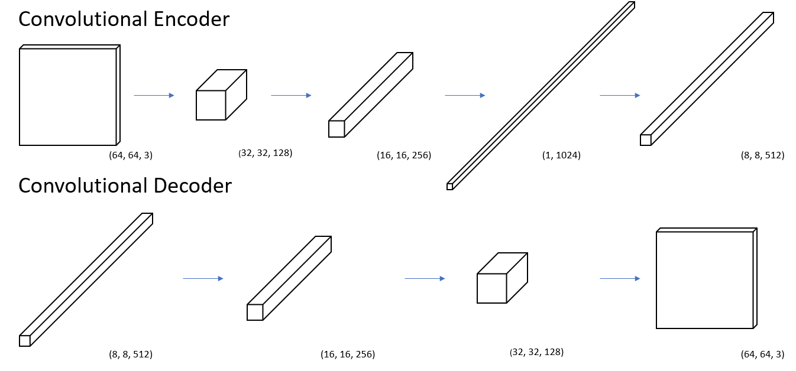
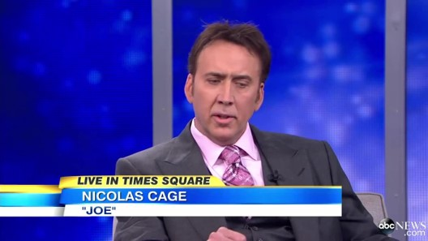
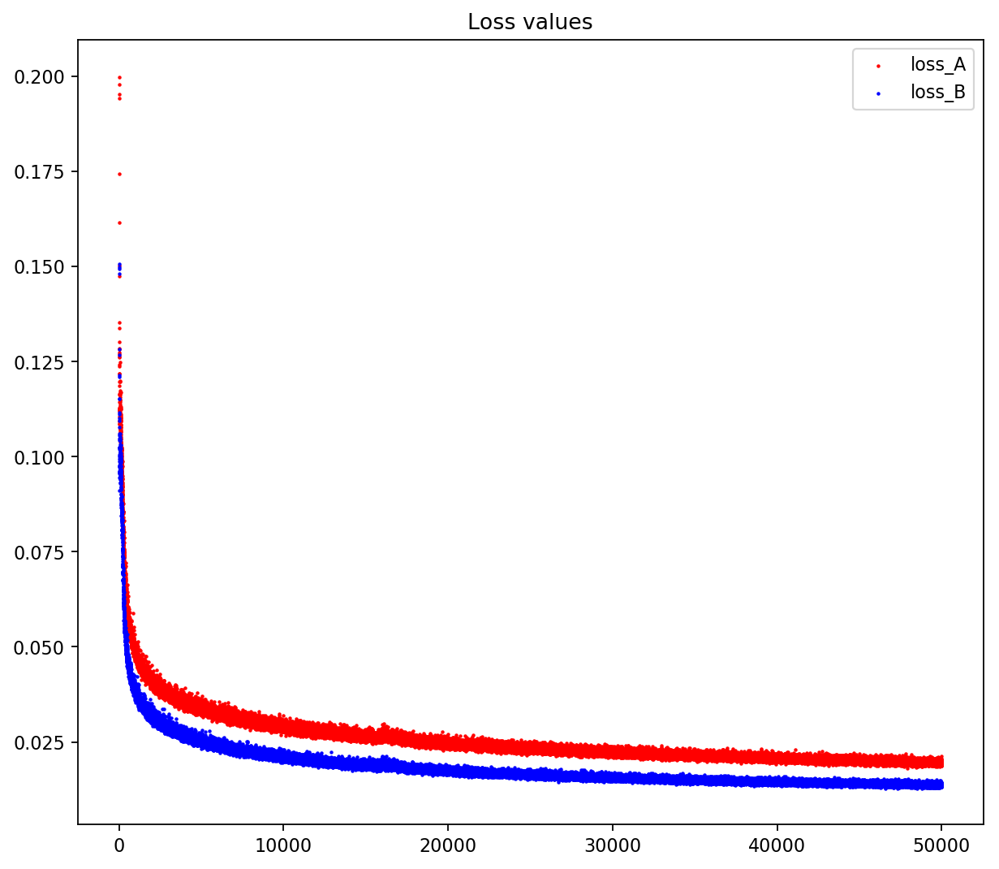

# Deepfakes in simple code

This is the github repo for our coursework project on studying a recent internet trend, deepfakes.

## Background
* Deepfakes utilized deep learning for swapping faces of two persons.
* The deepfakes github repo, which is under active development by the community, provides a lot of functionalities and options, which could be a barrier for understanding the essence of the original deepfakes model
* This repo extracts the essential bits from the deepfakes repo, and aims to assist the reader (e.g. our fellow schoolmates) to understand deepfakes technique easily

## Project setup

### 1. Model setup

`Autoencoder.py` contains the model setup for the one encoder and two decoders.  Below is an illustration of how the layers are set up.

### 2. Extract

`prepare_data.py` would extract, align and crop the face in input images for training data preparation.

### 3. Train

`train.py` will train the model with the prepared training data of target A and target B. A preview image will be shown during the training process.  Weights will be saved at each 100 iterations.  You may also press `Q` to save the weights and stop the training.

### 4. Convert

`convert.py` will convert target A or B to one another using the saved weights and the model.  It tracks the face in the input images, convert it and apply the new faces with a series of masking and opencv transformation.

> You may change the parameters such as INPUT_DIR, OUTPUT_DIR in the scripts.  Command line arg parser is not used to keep the clarity of the code.

## Handling video clips

The scripts does not include direct video processing for simplicity.  You may use `ffmpeg` for video conversion. Follow this [link](https://www.ffmpeg.org/download.html) for installation package.

To convert the video to images, run `ffmpeg -i input.mp4 frames-%05d.png`.  Then you may run `extract.py` (remember to change the INPUT_DIR, OUTPUT_DIR, etc) to prepare training data.

To combine images into video after running `convert.py`, run `ffmpeg -framerate 29.97 -i frames-%05d.png output.mp4`.  Framerate should match the input video.  To map the audio track of the input video to your converted video, run `ffmpeg -i output.mp4 -i input.mp4 -c copy -map 0:0 -map 1:1 output_with_sound.mp4`

## Requirements
Python requirements are listed in `requirements.txt`.  To install the requirements, run `pip install -r requirements.txt`.

To install GPU version of tensorflow, you will need CUDA and cuDNN from Nvidia. You may follow instructions over [here](https://www.tensorflow.org/install/).

*Note: You may need more that a `pip install dlib` to get dlib running. You may compile dlib or get the dlib wheel file over [here](https://github.com/charlielito/install-dlib-python-windows).*

## Our Hardware
> * Nvidia GTX 1070 8GB
> * Intel 8700K
> * 16GB DDR4 Ram

With the above hardware, we manage to train the model with batch size of 64 at 1~2 epochs per second.

For running `convert.py`, we are getting arround 2~3 images per second.

## Evaluation

### Training data 
Data source
* [George Clooney - Extended Interview](https://www.youtube.com/watch?v=cSB7SRAReY0)
* 
* [Nicolas Cage - Interview 2014: Actor Gets Rave Reviews for 'Joe'](https://www.youtube.com/watch?v=caxMBk1__-Y)
* 

Only around ~1.5 minutes of video clips are used
* 2,920 frames for George Clooney
* 2,142 frames for Nicolas Cage

### Training loss

Loss value drops quickly within the first 5000 epochs. Further drop could be constrained by limited variety of training data.

We believe there is overfitting after 10,000 epochs, however, we left our training continues as we only conduct faceswap on the same set of data.

### Visualizing the training process

### Results

* Converted
 

* Input

## Credit

Credit goes to deepfakes.

For latest development, please visit [deepfakes](https://github.com/deepfakes/faceswap).
